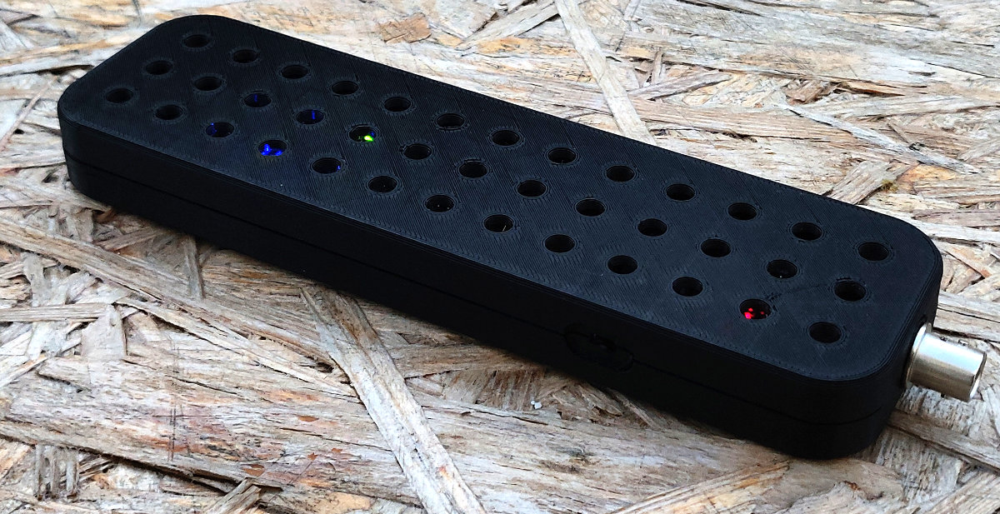

Introduction
============

The WiFi root node runs a web app which provides a bridge from the network (SAN)
to mobile devices such as phones.

Material
========

Components
----------

  * 3000 mAh battery: 80×50×6 mm

  * Adafruit 757: 4-channel I2C-safe bi-directional logic level converter -
    BSS138

  * Adafruit 2465: PowerBoost 1000 charger – rechargeable 5V LiPo USB boost @
    1A - 1000C

  * Adafruit 4090: USB C breakout board – downstream connection

  * Raspberry Pi Zero W

  * microSD card

  * BNC connector: Amphenol RF 31-221-RFX

  * SPDT switch: Sourcingmap A12013100UX0116

  * 4 × Screws: DIN 912, M2×5 mm

  * 4 × Nuts: DIN 934, M2

  * PLA for 3D printing

  * cables / wires

Additionally, helpful
---------------------

  * P400 grid sandpaper

  * Blu Tack (to help with fixing cables and components when soldering)

Case
====

Print the top and bottom of the case, place the components inside, and solder
them.

Software setup
==============

  * Install Linux on the Pi Zero, tested with Raspbian Buster Lite.

  * Install the web app.

  * Set up the Pi as a [WiFi access point][1].

  * Create a systemd service unit, and enable and start it:

        $ sudo ln -s "$PWD/san.service" /etc/systemd/system/
        $ sudo systemctl start san.service
        $ sudo systemctl enable san.service

    See also [systemd services][2] on the Raspberry Pi.

  * To redirect all DNS queries, setup “dnsmasquerade”:

        # ln -s "$PWD/redirectallhosts" /etc/dnsmasq.d/

    See also the blog post [DNS: Configure DNS to return the same IP Address for
    all hostnames][3].

  * To redirect all IPs to SAN, “iptables” is used.

        $ sudo vim /etc/sysctl.conf
        $ grep net.ipv4.ip_forward /etc/sysctl.conf
        net.ipv4.ip_forward=1
        $ sudo apt install iptables-persistent
        $ sudo iptables -t nat -A PREROUTING -p tcp --dport 80 -j DNAT \
          --to-destination 192.168.4.1:8080
        $ sudo iptables -t nat -A POSTROUTING -j MASQUERADE
        $ sudo iptables-save | sudo tee /etc/iptables/rules.v4

    See also:
    
      + Raspberry Pi forum post [Re: Captive Portal - Redirect all IP to Single
        IP][4].

      + `/etc/sysctl.conf`: To enable packet forwarding.

  * Install the official Arduino software with CLI support:

        $ wget https://downloads.arduino.cc/arduino-1.8.9-linuxarm.tar.xz
        $ tar xf arduino-1.8.9-linuxarm.tar.xz
        $ cd arduino-1.8.9-linuxarm
        $ sudo ./install.sh

  * Install: git@github.com:deanmao/avrdude-rpi.git

        $ export BIN=$HOME/arduino-1.8.9/hardware/tools/avr/bin
        $ cp avrdude-rpi/autoreset $BIN
        $ cp avrdude-rpi/avrdude-autoreset $BIN
        $ mv $BIN/avrdude $BIN/avrdude-original
        $ ln -s $BIN/avrdude-autoreset $BIN/avrdude

    Adapt paths:

        $ vim $BIN/avrdude-autoreset
        $ grep strace $BIN/avrdude-autoreset
        strace -o "|/home/pi/arduino-1.8.9/hardware/tools/avr/bin/autoreset" -eioctl /home/pi/arduino-1.8.9/hardware/tools/avr/bin/avrdude-original $@

  * Configure serial connection between Pi and Arduino according to the blog
    post [Raspberry Pi and Arduino connected over serial GPIO][5].

    Changes:

      + To stop and disable getty. See the documentation on [the Raspberry Pi
        UARTs][6].

      + Maybe also do:

            $ sudo systemctl stop serial-getty@ttyAMA0.service
            $ sudo systemctl disable serial-getty@ttyAMA0.service
            $ sudo systemctl disable getty@

      + Test:

            $ ~/arduino-1.8.9/arduino \
              --board arduino:avr:pro:cpu=16MHzatmega328 \
              --port /dev/serial0 \
              --upload ~/arduino-1.8.9/examples/01.Basics/Blink/Blink.ino

  * Install required libraries:

        $ ~/arduino-1.8.9/arduino --install-library "MultiTrans"
        $ ~/arduino-1.8.9/arduino --install-library "Adafruit NeoPixel"

  * Upload the root node firmware to the Arduino.

    First make sure that no other software, such as SAN, is accessing
    the serial port!

        $ ~/arduino-1.8.9/arduino \
          --board arduino:avr:pro:cpu=16MHzatmega328 \
          --port /dev/serial0 --upload ~/san/nodes/Firmware/Firmware.ino

To view serial output
=====================

First make sure that no other software, such as SAN, is accessing the serial
port!

    $ screen /dev/serial0 9600 # or any other appropriate baud rate

To give the Pi access to the Internet via a Linux system
========================================================

On the connecting computer:

 1. Set “$INET” to the network interface connected to the Internet.

 2. Set “$PI” to the interface to be connected to the Raspberry Pi.

 3. Connect and set up IP forwarding:

        # iw dev $PI connect SAN
        # sysctl net.ipv4.ip_forward=1
        # iptables -t nat -A POSTROUTING -o $INET -j MASQUERADE
        # iptables -A FORWARD -m conntrack --ctstate RELATED,ESTABLISHED -j ACCEPT
        # iptables -A FORWARD -i $PI -o $INET -j ACCEPT

On the Pi:

 1. Set “$GW” to the IP of the interface “$PI” on the computer.

 2. Set up routing via the default gateway:

        $ sudo route add default gw $GW

[1]: https://www.raspberrypi.org/documentation/configuration/wireless/access-point.md
[2]: https://www.raspberrypi.org/documentation/linux/usage/systemd.md
[3]: https://michlstechblog.info/blog/dns-configure-dns-to-return-the-same-ip-address-for-all-hostnames/
[4]: https://www.raspberrypi.org/forums/viewtopic.php?f=66&t=90155&p=764850#p764850
[5]: https://oscarliang.com/raspberry-pi-and-arduino-connected-serial-gpio/
[6]: https://www.raspberrypi.org/documentation/configuration/uart.md
